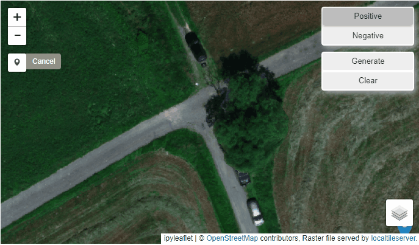

# multilayer-prompt-gis-segmentation

## Overview
A demonstration of using PyTorch for geospatial segmentation based on multi-band data (in this case multispectral bands: red, green, blue, near infrared, red edge). The solution works on a small amount of user prompted data.

## Running the code

Docker is required to run the environment. See *Dockerfile* to create a container on any operating system.

On Windows you can use *env.bat* to automatically create a container (Jupyter will be available at *localhost:8888*). 
